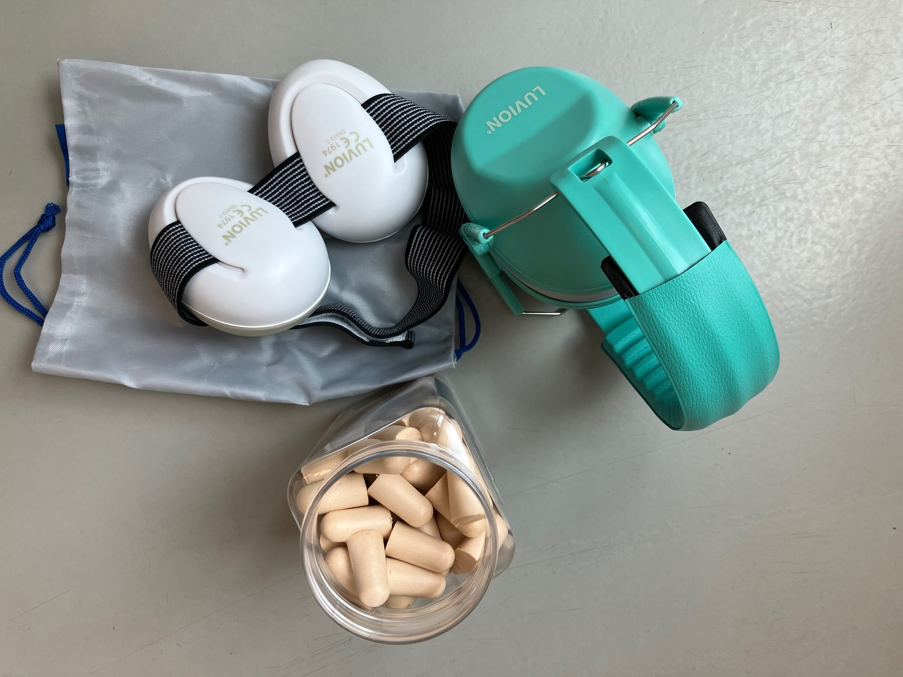

# Image placements — Plazey website

Visual reference: which photo goes in which slot per page. Use this when building the site.

Images embedded directly. Placeholders marked `> [PLACEHOLDER: ...]` where we still need a photo.

Relative path to media: `../../media/` from this file's location.

---

## S1 — Home

### Hero

The skeleton spec calls for a **custom illustration per edition** ("geen generieke stock foto"), not a photo in the traditional sense. The photo below serves as mood reference / design brief for the illustrator — it shows the composition, colour temperature, and atmosphere to aim for.

**Mood reference:**

*`537787901` — Captures the full festival in one frame. Plazey sign, string lights, diverse crowd, wheelchair user visible naturally. Ideal brief for the illustrator.*

---

### "Doe mee" callout section

*`528729450` — Reflective volunteer portrait, festival energy in the background. Use alongside the "Kom helpen" ghost button.*

---

### Sfeervolle achtergrond / atmosphere accent

If the design needs a photo block between sections (e.g. a full-bleed break between "Wat is Plazey" and the programme teaser):

*`529568369` — Multi-generational crowd, relaxed festival vibe. Strong landscape crop.*

> [PLACEHOLDER: Evening/dusk crowd shot — string lights lit, warm glow, people at tables after sunset. Currently only 1 evening photo in the set (stage only). Needed for a potential second hero rotation or off-hour atmosphere section.]

---

## S3 — Programma-item detail (per type)

Each programme item detail page has a hero image slot. Assign from this list based on item type. Where no photo exists, use the Plazey graphic fallback.

### Theatre / outdoor performance

*`528386718` — Best location-identity shot in the set. Basilica backdrop = unmistakably Koekelberg.*

### Street theatre / puppet / spectacle

*`490721594` — Whimsical and theatrical. Works for street performance, circus, and large-format acts.*

### Concert / main stage (evening)

*`538980955` — The only proper evening/stage-lit shot. Use for headliner or evening concert items.*

### Concert / outdoor stage (daytime)

*`538535839` — High energy, crowd visible, Basilica gives location context. Good for hip-hop/rap/urban acts.*

### Brass band / parade / marching

*`536285406` — Detail shot with motion. Good for brass band, fanfare, or parade programme items.*

### Dance event / workshop

*`535445939` — Joy and movement, diverse crowd, park setting. Works for dance workshops and free-dance sessions.*

### Kids: outdoor adventure / physical play

*`489990472` — Active and park-rooted. Good for movement or sport-based kids activities.*

### Kids: building / construction workshop

*`494512533` — Creative, hands-on, collaborative. Works for any crafts or building workshop.*

### Kids: nature / sensory play

*`487033617` — Tactile and exploratory. Fits nature workshops, sensory play, or ecology activities.*

### Kids: cooking / food workshop

*`490354341` — Hands-on cooking, park setting. Clear match for food/cooking workshops.*

### Kids: free play / sandbox

*`529235257` — Candid, tender, intergenerational. Works for free-play zones or baby/toddler-friendly activities.*

### Art installation / sculpture

*`538075720` — Sense of wonder and discovery. Good for sculpture trails or visual art installations.*

### Art in the park / outdoor exhibition

*`503383143` — Establishing shot with art context. Works for exhibitions, park trails, or visual art in public space.*

### Food stall / street food

*`528603322` — Celebratory energy at a food stall. Good for food programme items and market stalls.*

### Local produce / marché

*`529231824` — Fresh, local, earthy. Good for local produce market or neighbourhood food stalls.*

### Rommelmarkt / clothing swap / flea market

*`535448495` — Relaxed and community-oriented. Clear match for flea market or swap events.*

### Physical comedy / play / circus

*`486746883` — Joyful and physical. Good for comedy acts, play activities, or circus-adjacent performances.*

> [PLACEHOLDER: Spoken word / slam poetry / lecture — no suitable photo in current set. Needed for intellectually-framed programme items. A close-up of a speaker at a microphone with a small attentive crowd would work.]

> [PLACEHOLDER: Film / cinema screening — no photo in current set. Could be abstract (projection light, audience silhouettes in dusk).]

> [PLACEHOLDER: Main stage from audience perspective — wide shot looking at a large crowd + stage. The most classic festival photo and we don't have one. Needed for the biggest concert items.]

---

## S4 — Praktisch

### Bereikbaarheid — section header / accent

*`503383143` — Establishes the physical location of the festival. Works as a visual intro to the "how to get here" section.*

### Eten & drinken — section header

*`528603322` — Festive food energy. Strong header image for the eten & drinken section.*

### Eten & drinken — inline / supporting

*`529162241` — Food preparation close-up. Use as secondary image alongside the price list.*

*`528351191` — Bar atmosphere with volunteer staff visible. Use near the drinks price table.*

### Tokens / kassa

*`528547725` — Shows the token system in practice. Use inline near the "tokens worden aanvaard" note.*

### Toegankelijkheid — inline illustration

*`495741154` — Informational product shot. Use as a small inline image alongside the oordopjes entry in the toegankelijkheid list.*

> [PLACEHOLDER: Toegankelijkheid section header — a photo showing the festival being actively accessible. Options: accessible path to the site, a VGT interpreter in action, a visitor with a mobility aid navigating the festival comfortably. The current set only has the wheelchair user as a small figure in a wide crowd shot — not close enough to lead a section.]

> [PLACEHOLDER: "Baby Spot" / families area — `528283988` exists (Baby Spot caravan) but is better used on the Doe mee / Over Plazey page. Praktisch ideally needs its own families/kids-facilities photo, e.g. a baby changing area or a stroller parked at the entrance.]

---

## S5 — Over Plazey

### Page header / verhaal hero

*`528386718` — Strongest "sense of place" image in the set. The Basilica makes this unmistakably Koekelberg, Brussels. Use as the opening visual for the verhaal section.*

**Alternative** if a wider/more atmospheric crop is preferred:

*`537787901` — Full overview of the festival ground. More "festival" and less "theatre-specific".*

### Het verhaal — atmosphere / community accent

*`535445939` — Joy, diversity, movement. Works alongside the alinea about the festival evolving toward multilingualism and community programming.*

### Wie maakt Plazey — volunteers

*`528283988` — Human, warm, specific. Shows volunteers in a recognisable festival context.*

*`528351191` — Group volunteer shot, convivial energy. Use as secondary image.*

> [PLACEHOLDER: Organiser / core team portrait — a photo of the people from GC De Platoo and GC De Zeyp. Not a posed group shot needed; a candid behind-the-scenes moment would work better with the festival's tone. Currently missing entirely from the set.]

> [PLACEHOLDER: Behind the scenes / setup — a photo of the festival being built (volunteers setting up tents, stage rigging, decoration). Makes "wie maakt Plazey" more concrete and inviting for potential new volunteers.]

---

## S6 — Doe mee

### Page header / hero

*`528729450` — Best volunteer portrait in the set. Reflective expression, festival energy in the background. Clear visual signal: this is the "become a volunteer" page.*

### Vrijwilliger rollen — rol-kaart foto's

**Bar:**

*`528351191` — Directly illustrates the bar volunteer role.*

**Keuken / food:**

*`529162241` — Shows the cooking/food volunteer role.*

**Infostand / Baby Spot:**

*`528283988` — Shows the info-point volunteer role in context.*

**Kassa:**

*`528547725` — Shows the kassa/token counter role. Could double as the person at the counter = volunteer angle.*

> [PLACEHOLDER: Opbouw / afbouw volunteer role — a photo of volunteers setting up or dismantling the festival (tents, stage, tables). This role is listed in the skeleton but has no matching photo.]

> [PLACEHOLDER: Festival-wide "doe mee" atmosphere — an image that conveys the reward of volunteering: a moment of shared pride, celebration, or team energy among the volunteer crew. Currently no photo captures this "after a long shift" feeling.]

---

## Cross-cutting: photos available but not yet placed

These photos have strong potential but aren't assigned to a primary slot above. Available for use in editorial sections, callouts, or future pages.

| File | What it shows | Potential use |
|------|--------------|---------------|
| `490721594` | Giant puppet + park crowd (also listed under S3) | S1 Home programme teaser card |
| `529568369` | Crowd at picnic tables, families, string lights | S1 Home atmosphere accent (also listed) |
| `529231824` | Man with tomatoes at market stall | S4 Praktisch eten-inline, or S3 marché item |
| `529235257` | Children in sandbox | S4 Praktisch kinderen-section, or S3 kids-item |
| `538075720` | Wolf sculpture, parent + child | S3 art installation (also listed) |

---

*Last updated: 2026-04-12*
